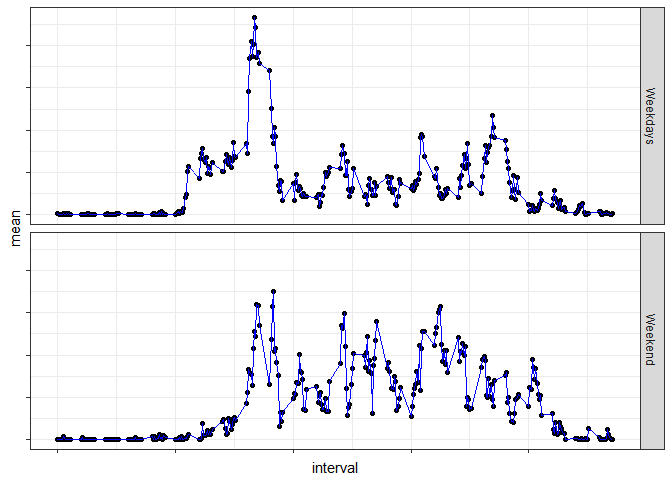

## Introduction

It is now possible to collect a large amount of data about personal movement using activity monitoring devices such as a Fitbit, Nike Fuelband, or Jawbone Up. These type of devices are part of the "quantified self" movement - a group of enthusiasts who take measurements about themselves regularly to improve their health, to find patterns in their behavior, or because they are tech geeks. But these data remain under-utilized both because the raw data are hard to obtain and there is a lack of statistical methods and software for processing and interpreting the data.

This assignment makes use of data from a personal activity monitoring device. This device collects data at 5 minute intervals through out the day. The data consists of two months of data from an anonymous individual collected during the months of October and November, 2012 and include the number of steps taken in 5 minute intervals each day.

## Loading and preprocessing the data

The first step of our analysis is to get access to the data we will work with and to get some insight about its structure.

### Data Loading

```r
# download a zip file containing broadband data, save it to the working directory
download.file("https://d396qusza40orc.cloudfront.net/repdata%2Fdata%2Factivity.zip", destfile="data.zip")

# unzip the file
unzip("data.zip")

# read the data into R,
data <- read.csv("activity.csv")

# print head to give insight on the data
head(data)
```

```
##   steps       date interval
## 1    NA 2012-10-01        0
## 2    NA 2012-10-01        5
## 3    NA 2012-10-01       10
## 4    NA 2012-10-01       15
## 5    NA 2012-10-01       20
## 6    NA 2012-10-01       25
```

## What is mean total number of steps taken per day?

To get some overall understanding of the steps distribution, we will have a look at the histogram of the total number of steps taken each day.

We first need to aggregate the data of all intervals for a defined day.


```r
StepPerDay <-tapply(data$steps,data$date,sum,na.rm=TRUE)
```


And then we can plot its distribution.


```r
library(ggplot2)
```

```
## Warning: package 'ggplot2' was built under R version 3.4.3
```

```r
qplot(StepPerDay,geom="histogram", main = "Frequency of Total Steps per Day", ylab = "Frequency", xlab = "Sum of steps", fill = I("blue"),col=I("black"))
```

```
## `stat_bin()` using `bins = 30`. Pick better value with `binwidth`.
```

<!-- -->


Mean and median calculations can add additional insight on the description of this sample.


```r
library(dplyr)
```

```
## Warning: package 'dplyr' was built under R version 3.4.3
```

```
## 
## Attaching package: 'dplyr'
```

```
## The following objects are masked from 'package:stats':
## 
##     filter, lag
```

```
## The following objects are masked from 'package:base':
## 
##     intersect, setdiff, setequal, union
```

```r
tbl_data <- tbl_df(data)
tbl_grouped_date <- group_by(tbl_data,date)
MeanMed <- summarize(tbl_grouped_date ,sum = sum(steps,na.rm=TRUE))
```


```r
m <- mean(MeanMed$sum,na.rm=TRUE)
```


```r
med <- median(MeanMed$sum,na.rm=TRUE)
```

Beside a concentration of the totoal number of steps at zero, that we could think of as a non compliance with the daily routine of wearing the device, the standard total number of steps per days is distributed around its median of 10395, with a mean at 9354.2295082

## What is the average daily activity pattern?

To better understand the step distribution during the day, we will take a look at the distribution during the day, averaged along the duration of the study.
We start by grouping the data within a same interval before averaging them for the study duration.


```r
tbl_grouped <- group_by(tbl_data,interval)
SS <- summarize(tbl_grouped,mean = mean(steps,na.rm=TRUE))
ggplot(data=SS,aes(x=interval,y=mean,group=1)) + geom_line(color="blue")+theme_bw()+theme(axis.text=element_blank())+ggtitle("Average daily activity pattern")
```

<!-- -->

There seems to be an activity peak during the day, let's look at this maximum number of steps and when it happens.


```r
filter(SS,mean == max(SS$mean))
```

```
## Warning: package 'bindrcpp' was built under R version 3.4.3
```

```
## # A tibble: 1 x 2
##   interval  mean
##      <int> <dbl>
## 1      835   206
```
The maximum number of steps in an average daily interval is 206.

## Imputing missing values

In order to get rid of the missing values that can introduce a bias into our calculation, we will replace the missing by the averaged interval value along the duration duration. We choose this approximation because we think the number of steps differs more between time of the day because of sleep for instance, whereas between days as we can expect some acitvity pattern for one person.


```r
# calculation of the total number of missing values in the data set
length(is.na(data$steps))
```

```
## [1] 17568
```

```r
# strategy used for filling the dataset is to take the average for the interval, using an anonymous function definition res
res <- function(x)return(SS$mean[x==SS$interval])

# new dataset creation with the automatically filled values in data2
data2 <- data
data2[is.na(data2)]<-res(data2$interval[is.na(data2)])
head(data2)
```

```
##       steps       date interval
## 1 1.7169811 2012-10-01        0
## 2 0.3396226 2012-10-01        5
## 3 0.1320755 2012-10-01       10
## 4 0.1509434 2012-10-01       15
## 5 0.0754717 2012-10-01       20
## 6 2.0943396 2012-10-01       25
```

```r
# creation of histogram for the total number of steps taken each day
StepPerDay2 <-tapply(data2$steps,data2$date,sum,na.rm=TRUE)
qplot(StepPerDay2,geom="histogram", main = "Frequency of Total Steps per Day on Corrected Data", ylab = "Frequency", xlab = "Sum of steps", fill = I("blue"),col=I("black"))
```

```
## `stat_bin()` using `bins = 30`. Pick better value with `binwidth`.
```

<!-- -->

```r
# compute mean and median for the updated data set
tbl_data2 <- tbl_df(data2)
tbl_grouped_date2 <- group_by(tbl_data2,date)
MeanMed2 <- summarize(tbl_grouped_date2 ,sum = sum(steps,na.rm=TRUE))
```


```r
m2 <- mean(MeanMed2$sum,na.rm=TRUE)
```


```r
med2 <- median(MeanMed2$sum,na.rm=TRUE)
```
We can see that the distribution profile is only slightly modified by our value replacement, the median and mean value slightly increase respectively from 9354.2295082 to 9530.7244046 and from 10395 to 1.0439\times 10^{4}

## Are there differences in activity patterns between weekdays and weekends?


```r
# Creation of a new factor variable to discriminate between "weekday" and "weekend"
tbl_data2 <- mutate(tbl_data2, AsDate = as.Date(date,"%Y-%m-%d"))
tbl_data2 <- mutate(tbl_data2, Weekday = ifelse(weekdays(tbl_data2$AsDate) %in% c("Monday","Tuesday","Wednesday","Thursday","Friday"),"Weekdays","Weekend"))
tbl_data2$Weekday <- as.factor(tbl_data2$Weekday)
head(tbl_data2)
```

```
## # A tibble: 6 x 5
##    steps date       interval AsDate     Weekday 
##    <dbl> <fctr>        <int> <date>     <fctr>  
## 1 1.72   2012-10-01        0 2012-10-01 Weekdays
## 2 0.340  2012-10-01        5 2012-10-01 Weekdays
## 3 0.132  2012-10-01       10 2012-10-01 Weekdays
## 4 0.151  2012-10-01       15 2012-10-01 Weekdays
## 5 0.0755 2012-10-01       20 2012-10-01 Weekdays
## 6 2.09   2012-10-01       25 2012-10-01 Weekdays
```


```r
# Creation of a panel with time series plot of average number of steps taken averaged accross all weekday days or weeken days
tbl_grouped3 <- group_by(tbl_data2,interval,Weekday)
SS3 <- summarize(tbl_grouped3,mean = mean(steps,na.rm=TRUE))
p <- ggplot(data=SS3,aes(x=interval,y=mean,group=1)) + geom_point() + geom_line(color="blue")+theme_bw()+theme(axis.text=element_blank())
p + facet_grid(Weekday~.)
```

<!-- -->

